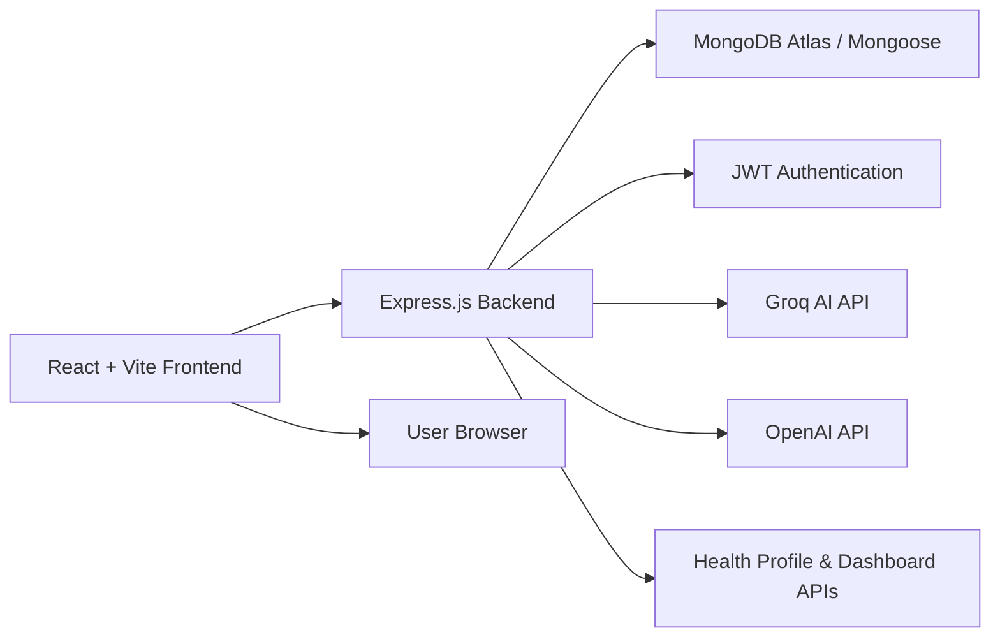

# HealthHub — AI-Powered Personal Wellness Platform

## 1. Overview

HealthHub is a full-stack wellness application designed to help users take control of their health journey through personalized insights, AI guidance, daily challenges, community engagement, and wellness-focused rewards. The platform combines a modern React frontend with a Node.js/Express backend, MongoDB storage, and AI-powered health assistance to deliver a smart, motivating experience for everyday users.

This project was built as a hackathon solution to address a real problem: many people want to improve their health, but they often struggle with fragmented tracking, lack of clear guidance, and limited access to personalized wellness support.

---

## 2. Problem Statement

Most health platforms today are either:

- too generic and not personalized,
- focused only on tracking without actionable recommendations,
- difficult to use for non-technical users, or
- disconnected from real wellness motivation.

People need a single place where they can:

- log and manage their health profile,
- receive smart recommendations,
- interact with an AI health assistant,
- stay motivated through challenges and community experiences, and
- access wellness-related resources in one intuitive dashboard.

---

## 3. What I Built

HealthHub brings together the following experiences into one product:

- User authentication and secure access
- Personalized health profile creation
- A wellness dashboard with progress tracking
- AI-powered health insights and conversational assistance
- Daily challenges and gamified engagement
- Community-style feed and social wellness interactions
- A store/rewards experience for motivation and engagement
- Consultation and healthcare resource discovery pages

The application is designed to feel like a “health companion” rather than just a data tracker.

---

## 4. Key Features

### User Experience

- Smooth landing page for product introduction
- Authentication flow with login and signup
- Protected routes for authenticated users only
- Responsive dashboard experience

### Health & Wellness

- Health profile form for age, weight, activity level, sleep, heart rate, and device preferences
- AI-generated health insights based on stored health profile data
- Conversational health assistant for user questions and wellness guidance

### Motivation & Engagement

- Daily challenges and wellness goals
- Community feed for sharing progress
- Leaderboard-style gamification inspiration
- Rewards/store page for healthy lifestyle motivation

### Healthcare Support

- Consultation page for doctors and hospitals
- Health-focused content and resource discovery

---

## 5. Architecture Diagram



### High-Level Flow

1. The frontend sends requests from the dashboard, auth pages, health form, and AI chat experience.
2. The backend authenticates users with JWT and processes health-related requests.
3. User data and health profiles are stored in MongoDB.
4. AI features use Groq/OpenAI to generate personalized health insights and assistant responses.

---

## 6. Screenshots

The following screenshots showcase the core experience of the application:

### Dashboard


### AI Assistant


### Community Feed


### Health Store


---

## 7. Tech Stack

### Frontend

- React
- Vite
- React Router
- CSS Modules / Custom CSS
- Axios / Fetch API

### Backend

- Node.js
- Express.js
- MongoDB
- Mongoose
- JWT Authentication
- Express Validator

### AI Integration

- Groq SDK
- OpenAI SDK

### Dev Tools

- Nodemon
- ESLint
- Git / GitHub

---

## 8. Project Structure

```text
backend/
  controllers/
  middleware/
  model/
  routes/
  index.js
  package.json

frontend/
  src/
    components/
    pages/
    services/
    utils/
  public/
    gitImage/
```

---

## 9. API Endpoints

Base URL: http://localhost:3001

### Authentication

| Method | Endpoint                    | Description             |
| ------ | --------------------------- | ----------------------- |
| POST   | /api/user/sign-up/data/post | Register a new user     |
| POST   | /api/user/login/data/post   | Log in a user           |
| POST   | /api/user/logout            | Logout the current user |
| GET    | /api/auth/verify            | Validate JWT session    |

### Health Profile

| Method | Endpoint                 | Description                            |
| ------ | ------------------------ | -------------------------------------- |
| POST   | /api/health-profile-form | Save or update the user health profile |
| GET    | /api/health-profile-form | Fetch the authenticated user's profile |

### Dashboard

| Method | Endpoint                | Description                              |
| ------ | ----------------------- | ---------------------------------------- |
| GET    | /api/dashboard/data/get | Fetch dashboard user data                |
| GET    | /api/dashboard/form     | Fetch health form/dashboard profile data |

### AI Assistant

| Method | Endpoint                  | Description                            |
| ------ | ------------------------- | -------------------------------------- |
| POST   | /api/ai-chat/post/message | Send chat messages to the AI assistant |
| POST   | /api/ai-chat/post/insight | Generate AI-based health insights      |

---

## 10. Installation & Setup

### Prerequisites

- Node.js (v18+ recommended)
- npm or yarn
- MongoDB connection string
- Groq API key
- OpenAI API key (if you use the older controller path)

### Backend Setup

```bash
cd backend
npm install
```

Create a .env file inside the backend folder:

```env
DATABASE_URL=your_mongodb_connection_string
GROQ_API_KEY=your_groq_api_key
OPENAI_API_KEY=your_openai_api_key
JWT_SECRET=your_secret_key
```

Start the backend server:

```bash
npm start
```

### Frontend Setup

```bash
cd frontend
npm install
npm run dev
```

The frontend will run on http://localhost:5173 and the backend on http://localhost:3001.

---

## 11. How the App Works

1. A user signs up or logs in.
2. The user fills out a health profile form.
3. The app stores profile details in MongoDB.
4. The dashboard displays a wellness overview and can request AI insights.
5. The user can interact with the AI assistant for health-related questions.
6. The community feed, challenges, and store sections increase engagement and motivation.

---

## 12. Security Notes

- JWT-based authentication protects private routes.
- Passwords are hashed using bcrypt.
- The app uses environment variables for secrets and API credentials.

> For production, it is recommended to move secrets to a secure secret manager and enable HTTPS.

---

## 13. Future Improvements

Potential enhancements for the next version:

- real device integration with fitness wearables,
- persistent progress charts and analytics,
- reminders and notifications,
- doctor booking workflow integration,
- real community posting and social features,
- admin panel for wellness content management.

---

## 14. Credits

Built as a hackathon project focused on combining wellness, AI, and user engagement in one experience.

---

## 15. License

This project is intended for educational and demonstration purposes.
>>>>>>> 31c1cd9 (docs: Modified README.md file)
